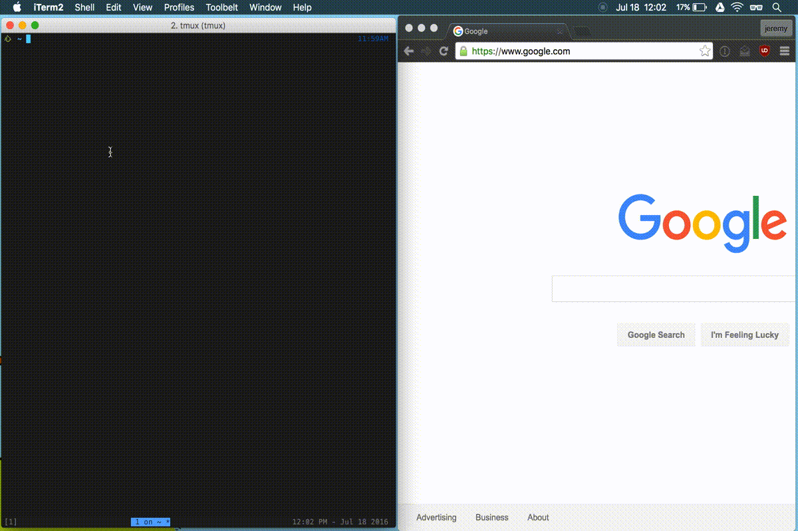

# :bookmark: booker

a CLI bookmark manager for Chrome and Firefox, with tab completion.

## setup

    [sudo] gem install booker
    booker --install

Alternatively, the installation can be done incrementally:

    booker -i comp # adding tab completion (ZSH only)
    booker -i conf # generate default config (~/.booker.yml)
    booker -i book # locating bookmarks file

## :bookmark: `booker` usage

##### bookmark completion

    booker [your_search_term]<TAB>

##### opening a website

    booker github.com/jeremywrnr/booker

##### using a search engine

    booker how to use the internet

## about
This is a tool that allows you to tab complete (in zsh only) Chrome and Firefox
bookmarks, and then open them in the browser of your choice. Chrome stores
bookmarks in a JSON file, while Firefox uses a SQLite database. Booker can
read and parse both formats, and can even search across multiple bookmark
sources simultaneously. Combined with an autocompletion mechanism (using a zsh
script), you can easily open your bookmarks from the command line.

I was inspired by the `kill` autocompletion that ships with oh-my-zsh, where
you are shown a list of the current processes, and you can tab through to
select which one you'd like to kill. The completion actually is somewhat
complex - if I search for 'System', it will only show processes whose name or
group match against that, but it tab through these matches numeric process IDs,
which is the argument that `kill` actually takes. I learned that zsh
autocompletion has a large learning curve, despite the good amount of
documentation out there on it.

## config
You can also edit the `~/.booker.yml` config file manually.
booker will also try to determine which command should be used to open your
browser based on your operating system, but you can also explicitly choose
which command you want use, by adding the following:

    :browser: 'your-browser-command '

## development / testing
There are some tests in `/spec`. If you clone this repo you can run them with
`just spec`. There is also a justfile to build and install the gem locally, so
you can run `just build` to build the gem. To develop the zsh completion script,
clone this repo, and run:

    booker --install completion && unfunction _booker && autoload -U _booker

## todos
- tab completion for other shells (bash, fish)
- support other browsers? (safari, edge)
